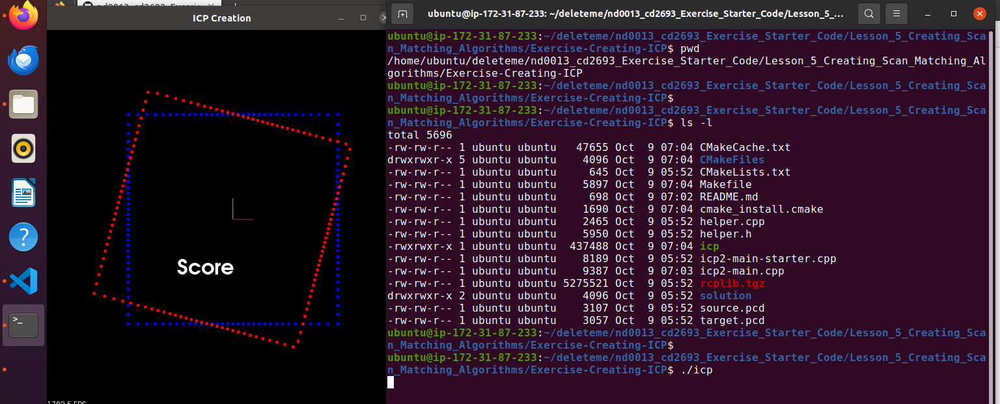

# Exercise: Creating ICP

1. Navigate to the **nd0013_cd2693_Exercise_Starter_Code/Lesson_5_Creating_Scan_Matching_Algorithms/Exercise-Creating-ICP** directory. 


2. Complete the TODO's in `icp2-main.cpp` per the instructions in the classroom. 


3. Once you finish editing the CPP file, you can compile and run the program using the commands below: 
    ```bash
    # Compile
    cmake .
    make
    # Run
    ./icp
    ```

4. Verify. The screenshot below shows the successful running ICP exercise.

    


5. If you need help, you can refer to the solution in the **solution/** sub-directory and try again. 