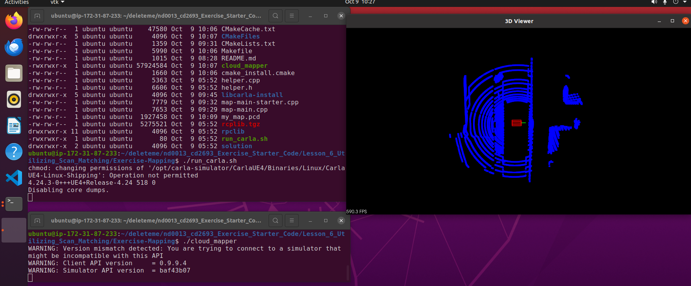

# Exercise: Mapping

1. Naviagte to the **nd0013_cd2693_Exercise_Starter_Code/Lesson_6_Utilizing_Scan_Matching/Exercise-Mapping** directory. 


2. Complete the TODO's in **map-main.cpp** per the instructions in the classroom. 


3. Once you finish editing the CPP file, you can compile and run the program using the commands below: 

    ```bash
    # Compile
    cmake .
    make
    ```
    The command above will generate the **cloud_mapper** executable file. At this point, you will have the following files in your current working directory:
    ```bash
    .
    ├── CMakeCache.txt
    ├── CMakeFiles          #autogenerated
    ├── CMakeLists.txt
    ├── Makefile            #autogenerated
    ├── README.md
    ├── cloud_mapper        #autogenerated
    ├── cmake_install.cmake #autogenerated
    ├── helper.cpp
    ├── helper.h
    ├── libcarla-install    #Static binaries
    ├── map-main-starter.cpp
    ├── map-main.cpp
    ├── my_map.pcd
    ├── rcplib.tgz
    ├── rpclib
    ├── run_carla.sh
    └── solution            #solution, if you need it. 
    ```


4. Open a new Terminal window, navigate to the exercise directory, and run the Carla simulator.

    ```bash
    ./run_carla.sh
    ```

    You should get the following output. Ignore the *Operation not permitted* warning in the output below.
    ```bash
    chmod: changing permissions of '/opt/carla-simulator/CarlaUE4/Binaries/Linux/CarlaUE4-Linux-Shipping': Operation not permitted
    4.24.3-0+++UE4+Release-4.24 518 0
    Disabling core dumps.
    ```


5. Open another Terminal window and navigate to the exercise directory. Execute the following command to run the **cloud_mapper**. 

    ```bash
    ./cloud_mapper
    ```
    Might have core dump on start up; just rerun if so. 


6. Verify. The screenshot below shows the successful running exercise.

    


7. If you need help, refer to the solution in the **solution/map-main-solution.cpp** file and try again. 


## Appendix
The following file **Lesson_6_Utilizing_Scan_Matching/Exercise-Mapping/libcarla-install/lib/libcarla_client.a**  has a size of more than 100MB. So, if you happen to edit this file and push the edits to remote, you will face the error with the following message:
> Large files detected. You may want to try Git Large File Storage - https://git-lfs.github.com.


In such a case, you must follow the steps below to push your edits to the remote repository. 

1. [Install Git-LFS](https://github.com/git-lfs/git-lfs/wiki/Installation#ubuntu)
    ```bash
    sudo apt-get install software-properties-common
    sudo curl -s https://packagecloud.io/install/repositories/github/git-lfs/script.deb.sh | sudo bash
    sudo apt-get install git-lfs
    git lfs install
    ```


2. Let the LFS track the files. 

    ```bash
    git lfs track "*.a"
    git add .
    git commit -m "lfs"
    ```    


3. Push
    ```bash
    git lfs push --all origin main
    ```


4. If the LFS push does not succeeds due to OAuth or related issue, you can try the following command. 
    ```bash
    git push -f --no-verify
    ```