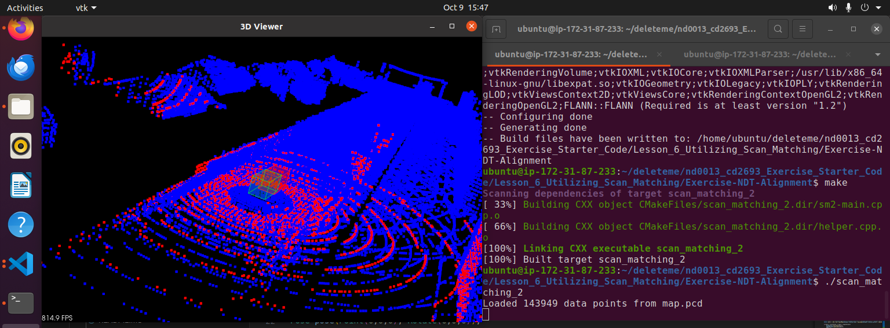

# Exercise: NDT Alignment


1. Naviagte to the **nd0013_cd2693_Exercise_Starter_Code/Lesson_6_Utilizing_Scan_Matching/Exercise-NDT-Alignment** directory. 


2. Complete the TODO's in **sm2-main.cpp** per the instructions in the classroom. 


3. Once you finish editing the CPP file, you can compile and run the program using the commands below: 
    ```bash
    # Compile
    cmake .
    make
    # Run
    ./scan_matching_2
    ```

4. Verify. The screenshot below shows the successful running ICP exercise.

    


5. If you need help, you can refer to the solution in the **solution/** sub-directory and try again. 