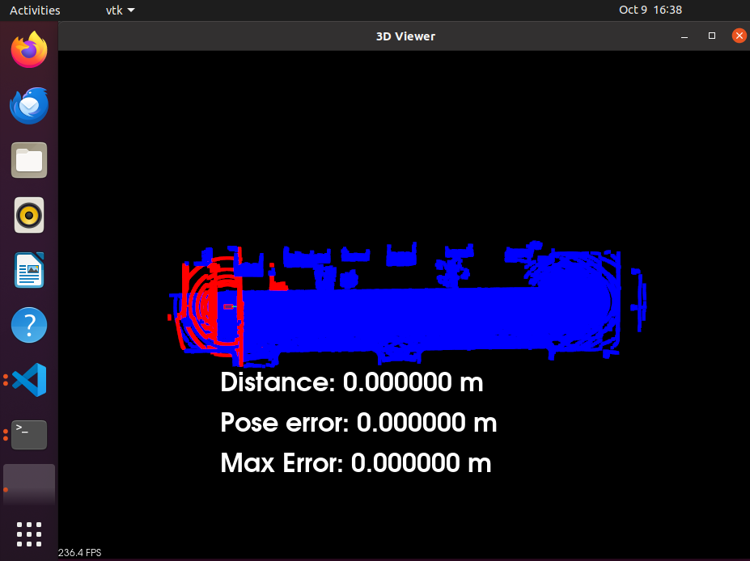

# Instructions to Execute the Project

1. Navigate to the **c3-project** directory containing the project starter files.
    ```bash
    cd nd0013_cd2693_Exercise_Starter_Code/Lesson_7_Project_Scan_Matching_Localization/c3-project
    ```


2. Review the starter files. You must find the following files in your current working directory.
    ```bash
    .
    ├── CMakeLists.txt
    ├── README.md
    ├── c3-main.cpp
    ├── helper.cpp
    ├── helper.h
    ├── make-libcarla-install.sh
    ├── map.pcd
    ├── map_loop.pcd
    ├── rpclib
    └── run_carla.sh
    ```


3. Ensure that the **libcarla-install/** folder is present in your current working directory. This folder contains the static binaries built for the target VM workspace environment. You will need to regenerate it using the following commands in order:
    ```bash
    chmod +x make-libcarla-install.sh
    ./make-libcarla-install.sh
    ```


4. Update the ** c3-main.cpp** file per the `TODO` markers and the classroom instructions. 


5. Compile the project using the following commands. 

    ```bash
    cmake .
    make
    ```
    These steps will generate the **clooud_loc** executable. 


6. Open a new Terminal tab and execute the following command to start the simulator.

    ```bash
    ./run_carla.sh
    ```  


7. Open another Terminal tab and execute the following to run the project.
    ```bash
    ./cloud_loc 
    ```
If you encounter core dump on start up, just rerun and try again. Crash doesn't happen more than a couple of times. 


Here is a glimpse of the running project.


